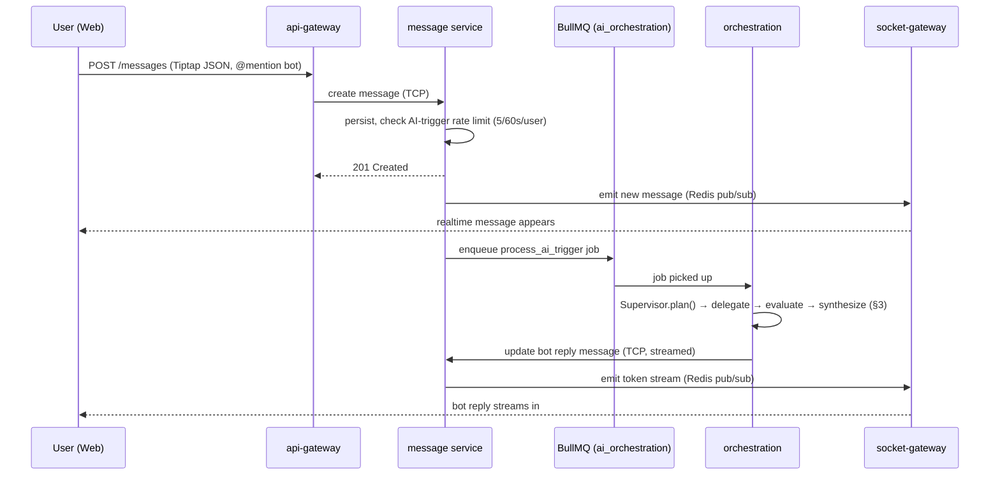
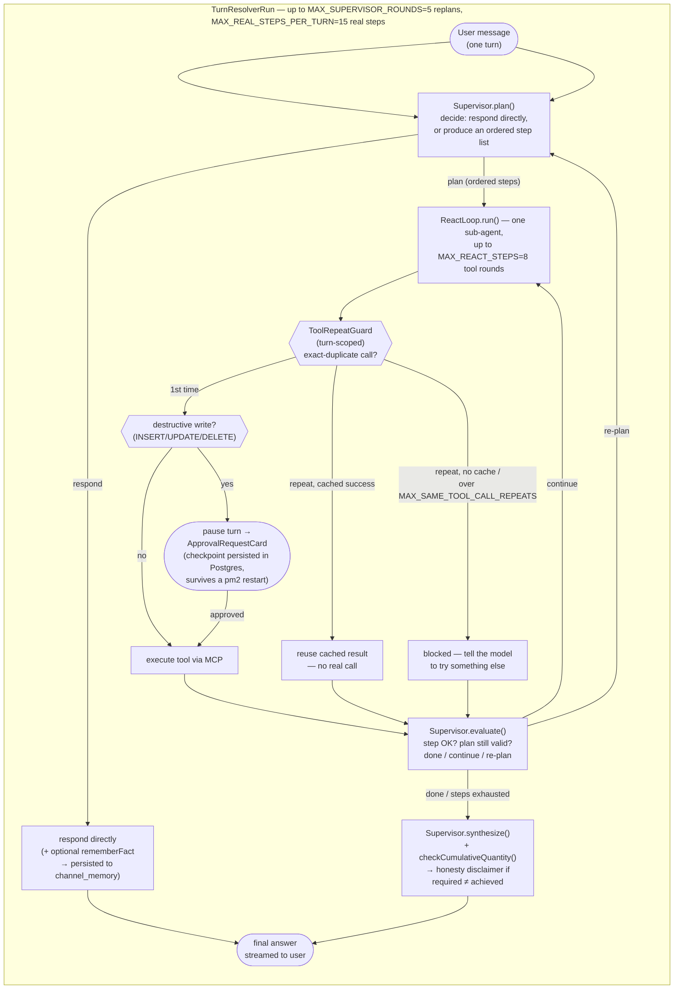

# Architecture

15 independent NestJS microservices. No shared in-process state — every cross-service call goes over the wire
(`@nestjs/microservices` TCP for request/response, BullMQ/Redis for async fire-and-forget work). Any service can
be deployed, scaled, or crash-restarted on its own.

## 1. System overview

```mermaid
flowchart TB
    Client["Web client\n(React + Tiptap editor)"]

    subgraph Edge["Edge"]
        GW["api-gateway\nHTTP REST, JWT auth\nport 3000"]
        WS["socket-gateway\nSocket.IO, Redis adapter\nrealtime fan-out"]
    end

    subgraph Core["Core domain services (TCP, request/response)"]
        AUTH["auth :3001"]
        USER["user :3002"]
        WORKSPACE["workspace :3003"]
        CHANNEL["channel :3004"]
        MESSAGE["message :3005"]
        TASK["task :3006"]
        NOTIF["notification :3007"]
        VIDEO["video-call :3009"]
        BILLING["billing :3010"]
        INTEG["integrations :3011"]
        CANVAS["canvas :3012"]
        CAL["calendar :3013"]
    end

    ORCH["orchestration :3014\n(\"Agent OS\" — see §3)"]

    PG[("PostgreSQL\n+ pgvector")]
    REDIS[("Redis\ncache + BullMQ + pub/sub")]
    EXT["External systems\nSQL Server · GitHub · Google Workspace\nNotion · Slack · any Swagger API"]
    LLM["LLM providers\nOpenAI · Anthropic · Gemini\n(via self-hosted router)"]

    Client -->|HTTPS| GW
    Client <-->|WSS| WS
    GW -->|TCP| AUTH & USER & WORKSPACE & CHANNEL & MESSAGE & TASK & NOTIF & VIDEO & BILLING & INTEG & CANVAS & CAL
    GW -->|TCP| ORCH
    MESSAGE -->|BullMQ: ai_orchestration| ORCH
    ORCH -->|TCP| MESSAGE & CHANNEL & USER
    ORCH -->|MCP| EXT
    ORCH --> LLM

    AUTH & USER & WORKSPACE & CHANNEL & MESSAGE & TASK & NOTIF & VIDEO & BILLING & INTEG & CANVAS & CAL & ORCH --> PG
    AUTH & MESSAGE & WS & ORCH --> REDIS
    WS -.pub/sub.- REDIS
```

Every core service owns its own tables (no cross-service joins); cross-service reads go through the TCP call, not
a shared DB connection. `libs/database` centralizes the TypeORM data-source config so migrations stay consistent
across services that share the one Postgres instance.

## 2. A message, end to end



The AI trigger is **not** on the request/response path — the HTTP call returns as soon as the message is saved.
Everything the agent does happens asynchronously off a queue, so a slow/stuck agent turn never blocks the chat
itself.

## 3. Agent OS — the orchestration engine

This is the part of the system built specifically to answer "what happens when you stop trusting the model by
default." One turn = one triggering user message, resolved by a **Supervisor** (plans, never executes tools
itself) delegating to a **ReAct loop** (one per sub-agent call, actually executes tool calls).



### Safety mechanisms, and why each one exists

| Mechanism | What it stops | Constant |
|---|---|---|
| **Turn-scoped tool-call dedupe** | Supervisor re-planning the same read/write twice in one turn → wasted LLM+tool spend, or a destructive action approved twice | `MAX_SAME_TOOL_CALL_REPEATS=1` |
| **HITL approval gate** | Any write/delete running without a human seeing it first. Approved-then-failed actions **do not auto-retry** — a failed delete is not something to silently retry | — |
| **Checkpoint persistence** | Losing an in-flight approval if the process restarts — checkpoints live in Postgres, not memory | `orchestration_checkpoints` table |
| **Cumulative quantity honesty check** | The model claiming "12/12 done" when only 6 tool calls actually succeeded — checked once per `ReactLoop.run()` *and* once more across the whole turn, since Supervisor can split one request into several steps | `checkCumulativeQuantity()` |
| **Circuit breaker per provider** | One flaky external system (or LLM provider) taking down unrelated requests | keyed `llm:<strategy>` / `mcp:<provider>` |
| **Rate limits** | A single user (or workspace) monopolizing the AI queue | `AI_TRIGGER_RATE_LIMIT=5/60s` per user (global, not per-workspace) |
| **Hard step/round caps** | An agent loop that never converges running forever | `MAX_REACT_STEPS=8`, `MAX_SUPERVISOR_ROUNDS=5`, `MAX_REAL_STEPS_PER_TURN=15` |
| **PII/secret scrubbing** | Raw tool/provider error messages leaking credentials back to the user | `PiiScrubberUtil` |

None of these were designed on paper and left alone — every one has a corresponding entry in
[`manual_test_bank_heavy.md`](../../slack-docs/docs/Documents/Orchestration/manual_test_bank_heavy.md) showing it
tested against a real running system, including the times a mechanism *didn't* work as intended and had to be
fixed (e.g., dedupe was originally scoped per-ReactLoop-call instead of per-turn, so a Supervisor re-plan could
still slip a duplicate write through — found live, root-caused, fixed, re-verified).

## 4. Memory model

Three different lifetimes, used for different purposes — collapsing them into one would either lose data too
early or let stale data leak back in as fact:

- **Raw recent history** (`CHAT_HISTORY_LIMIT` messages) — verbatim, but the AI's *own* past answers are redacted
  to a placeholder. Otherwise a stale answer becomes "trusted" context for a new question.
- **Truncated-history summary** — a small rule-based recap of the next-oldest batch of messages, so context
  doesn't just vanish the instant it scrolls past the raw window.
- **`channel_memory`** (Postgres, read on every `plan()` call regardless of history length) — durable facts:
  successful create/write tool results, and explicit user-declared facts ("remember my VIP code is X") extracted
  via a dedicated `rememberFact` field so "remember this" isn't just a friendly reply that quietly forgets itself
  once the conversation moves on.

## 5. Load-tested, not guessed

`loadtest/` has k6 scripts plus a bulk-user-seeding script that writes directly to Postgres and self-signs JWTs
(matching the real `auth.service.ts` token payload) to get past register/login rate limits when seeding hundreds
of test users. Real findings from ramping 100 → 300 → 1000 concurrent users are in
[`manual_test_bank_load.md`](../../slack-docs/docs/Documents/Orchestration/manual_test_bank_load.md) — including
the actual breaking point (a connection-pool ceiling around the 300-CCU mark) and the config change that
measurably improved it.
